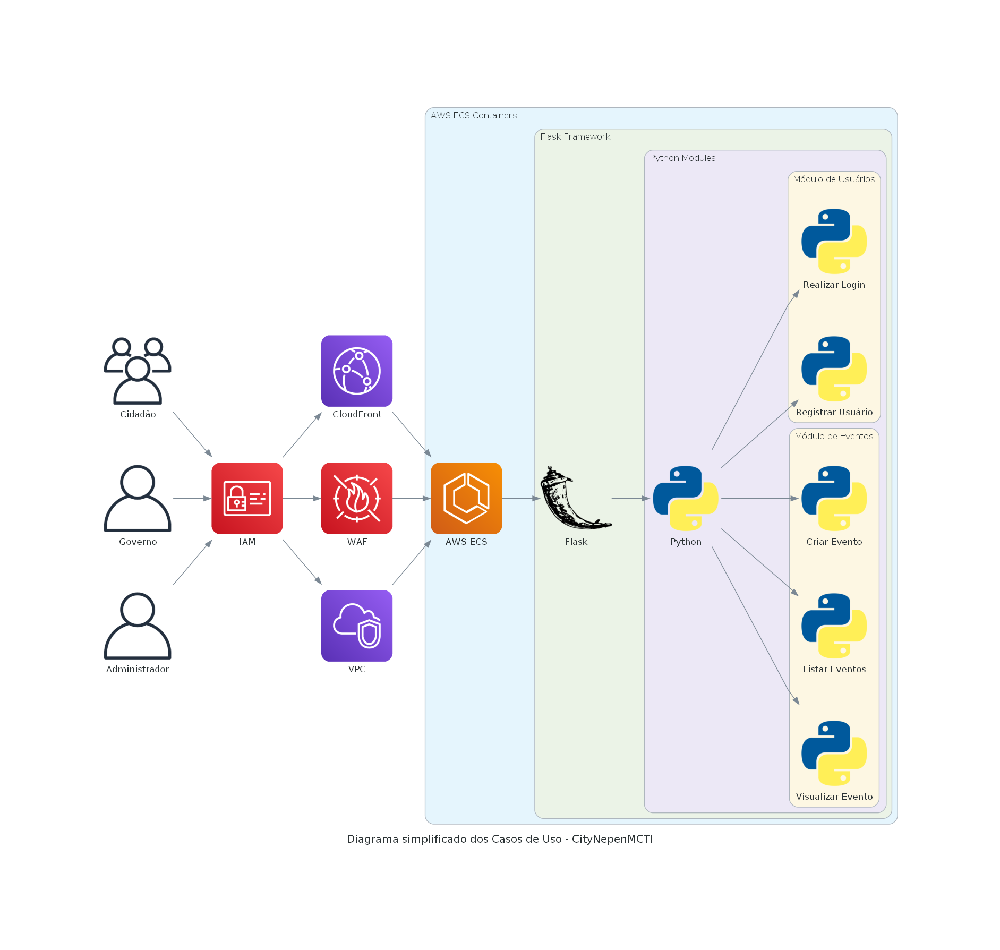

# Documentação de Diagramas - Projeto CityNepenMCTI

Este documento fornece uma visão abrangente dos vários diagramas utilizados para modelar a arquitetura e o design do sistema CityNepenMCTI.

## Figura 1: Diagrama C4 de Contêiners

Este diagrama fornece uma visão de alto nível dos contêiners que compõem o sistema, abordando os diferentes tipos de usuários e suas interações com a aplicação.

---

## Figura 2: Diagrama de Classes

O Diagrama de Classes fornece uma representação estática da estrutura de classes do sistema e suas associações, permitindo entender as responsabilidades e colaborações entre as diferentes entidades.

---

## Figura 3: Diagrama de Sequência

Este diagrama ilustra a sequência de interações entre objetos e componentes durante um cenário específico, fornecendo insights valiosos sobre o comportamento do sistema.

---

## Figura 4: Diagrama ER de Eventos

Este diagrama apresenta o modelo de dados de eventos, especificando como os eventos são gerados, processados e armazenados no sistema.

---

## Figura 5: Diagrama de Estado de Eventos

Este diagrama ilustra as diferentes fases ou estados pelos quais um evento pode passar, bem como as transições possíveis entre esses estados.

---

## Figura 6: Diagrama de Casos de Uso Simplificado

Este diagrama proporciona uma visão simplificada dos diferentes casos de uso que o sistema suporta, focando em funcionalidades de nível mais alto.

---

## Figura 7: Diagrama de Casos de Uso com Framework Bem Arquitetado

Este diagrama expande a visão de casos de uso, incorporando elementos do Framework Bem Arquitetado da AWS, para garantir uma arquitetura resiliente e escalável.

